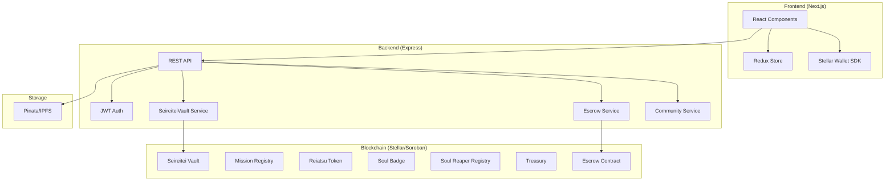
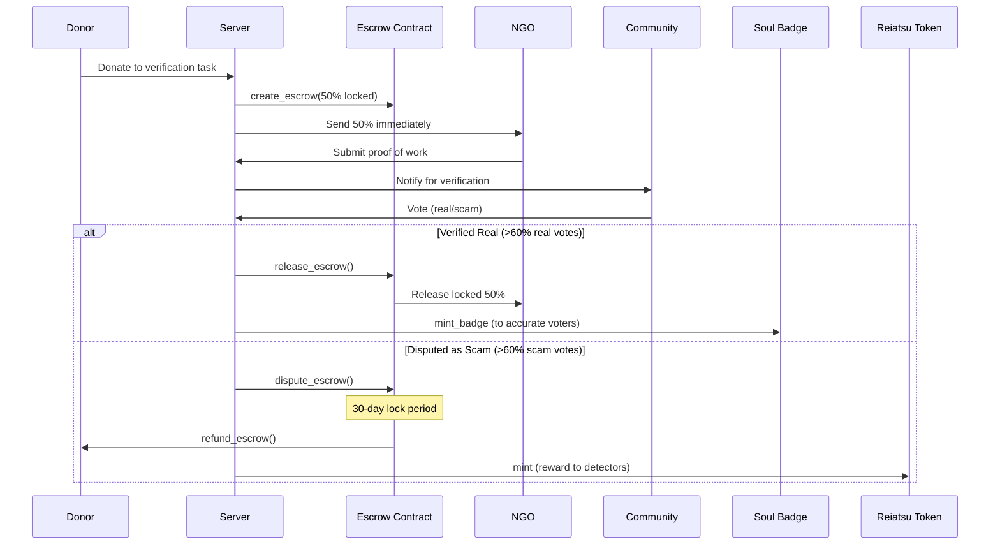

<div align="center">
  <h1 align="center">✨ Soul-Society</h1>
  <p align="center">Revolutionizing Aid Distribution with Blockchain Technology</p>
  
  [](https://opensource.org/licenses/MIT)
  [](https://stellar.org/)
  [](https://nextjs.org/)
  [](https://soroban.stellar.org/)
  [](https://github.com/yourusername/soul-society/actions)

  
</div>

---

## 📖 Documentation

Detailed documentation has been moved to the `docs/` directory:

- [🔧 Environment Setup (Frontend & Server)](docs/ENV_SETUP.md)
- [📚 API Documentation](docs/API_DOCUMENTATION.md)
- [🧩 Smart Contracts](docs/SMART_CONTRACT_README.md)
- [💰 Payment Flow Guide](docs/PAYMENT_FLOW_GUIDE.md)
- [🔒 Seireitei Vault](docs/VAULT.md)
- [🛠 Backend Server Guide](docs/SERVER_README.md)

---

## 🏗 System Architecture (On-Chain First)

Soul-Society is built with an **On-Chain First** architecture. Instead of relying on a traditional central database for mission-critical data, we leverage the **Stellar/Soroban blockchain** for persistent, decentralized storage. 

> [!NOTE]
> **Performance Note**: Because we bridge directly to the blockchain for data integrity, some pages may take a few moments to load while fetching the latest on-chain state. Thank you for your patience as we ensure the highest level of transparency and security.

### 🧩 Hybrid Infrastructure
We use a high-performance Next.js frontend, an Express.js backend for off-chain coordination (indexing and caching), and a suite of Soroban smart contracts for source-of-truth data.



---

## 🛡️ Escrow & Governance ("Lock, Do Work, Get Paid")

The core of Soul-Society is the **Trustless Escrow System** designed to prevent charity fraud.

### How it Works
1. **Donation**: Donor contributes to a task. 50% goes to NGO immediately; 50% is **locked in escrow**.
2. **Proof**: NGO submits proof-of-work (photos/videos) to IPFS.
3. **Verification**: Community members vote on the authenticity of the proof.
4. **Outcome**:
   - ✅ **Verified**: Locked funds released to NGO. Voters earn **Soul Badges** and **Reiatsu Tokens**.
   - ❌ **Scam**: Funds remain locked for 30 days, then **refunded to donor**.



---

## 🚀 Getting Started

### Prerequisites
- Node.js v20+
- Cargo & Rust (for contracts)
- Docker (optional)

### Quick Start (Docker)
```bash
docker-compose up --build
```
This starts:
- Frontend: http://localhost:3000
- Server: http://localhost:8000

### Manual Setup

#### 0. Environment variables
- **Server:** Copy `server/.env.example` to `server/.env` and fill in secrets (JWT, Pinata, Stellar). After deploying contracts, run `./deploy_contract.sh` to write contract IDs into `server/.env`.
- **Frontend:** Copy `frontend/.env.example` to `frontend/.env.local`. Set `NEXT_PUBLIC_API_URL` to your API URL (e.g. `http://localhost:8000/api` for local dev). See [Environment Setup](docs/ENV_SETUP.md) for details.

#### 1. Smart Contracts
```bash
cd smartContract
cargo test  # Verify all tests pass
```

#### 2. Server
```bash
cd server
npm install
npm run dev
```

#### 3. Frontend
```bash
cd frontend
npm install --legacy-peer-deps
npm run dev
```

---

## 🏆 Stellar Journey to Mastery — Level-wise Checklist

### Level 2 — White Belt (Multi-wallet, Contract, Real-time)

**Focus:** StellarWalletsKit, error handling, contract deployment, frontend contract calls, transaction status.

| Requirement | Status |
|-------------|--------|
| 3 error types handled (wallet not found, rejected, insufficient balance) | [x] Done — see `frontend/lib/redux/slices/wallet-slice.ts` |
| Contract deployed on testnet | [x] Done — run `./deploy_contract.sh`; addresses in `server/.env` |
| Contract called from the frontend | [x] Done — Escrow XDR flow in `donate-modal`, `simple-donate-modal`, `stellar-utils.ts` |
| Transaction status visible | [x] Done — success/error steps + tx hash + Stellar Explorer link in donate modals |
| Minimum 2+ meaningful commits | [x] Done |

**Deliverable:** Multi-wallet app with deployed contract and real-time event integration — [x] Done

**Submission (optional):**
- [ ] Live demo link (Vercel/Netlify)
- [ ] Screenshot: wallet options available
- [ ] Deployed contract address (see **Deployed contract addresses** below)
- [ ] Transaction hash of a contract call (verifiable on [Stellar Explorer](https://stellar.expert))

---

### Level 3 — Orange Belt (Mini-dApp, Tests, Docs, Demo)

**Focus:** Loading states, caching, tests, README, demo video.

| Requirement | Status |
|-------------|--------|
| Mini-dApp fully functional | [x] Done |
| Minimum 3 tests passing | [x] Done — Server: 38 Jest tests; Smart contracts: 54 `cargo test`; Frontend: Playwright e2e |
| README complete | [x] Done — setup, architecture, level checklists |
| Demo video recorded | [ ] Optional — 1-minute demo link in README when ready |
| Minimum 3+ meaningful commits | [x] Done |

**Deliverable:** Complete mini-dApp with documentation and tests — [x] Done

**Submission (optional):**
- [ ] Live demo link (Vercel/Netlify)
- [ ] Screenshot: test output showing 3+ tests passing
- [ ] Demo video link (1-minute) showing full functionality

---

### Level 4 — Green Belt (Production-ready)

**Focus:** Inter-contract calls, custom token/pool, CI/CD, mobile responsive.

| Requirement | Status |
|-------------|--------|
| Inter-contract call working | [x] Done — Escrow ↔ Reiatsu Token ↔ Soul Badge (release/vote flows) |
| Custom token or pool deployed | [x] Done — Reiatsu Token (RA) with staking & vesting |
| CI/CD running | [x] Done — GitHub Actions: smart contracts, server, frontend (Playwright) |
| Mobile responsive | [x] Done — responsive header, breakpoints, touch-friendly UI |
| Minimum 8+ meaningful commits | [x] Done |

**Deliverable:** Production-ready advanced contract implementation — [x] Done

**Submission (optional):**
- [ ] Live demo link (Vercel/Netlify)
- [ ] Screenshot: mobile responsive view
- [ ] Screenshot or badge: CI/CD pipeline running
- [ ] Contract addresses and transaction hash (see below)
- [ ] Token or pool address (Reiatsu Token — see below)

---

### Deployed contract addresses (Testnet)

After running `./deploy_contract.sh`, contract IDs are written to `server/.env`. Example (replace with your deployed IDs):

| Contract | Env variable | Example (yours may differ) |
|----------|--------------|-----------------------------|
| Vault | `VAULT_CONTRACT_ID` / `CONTRACT_ID` | `CBF4NN26...` |
| Mission Registry | `MISSION_REGISTRY_CONTRACT_ID` | `CCPFZ5HP...` |
| Escrow | `ESCROW_CONTRACT_ID` | `CBFDAJVK...` |
| Reiatsu Token | `REIATSU_TOKEN_CONTRACT_ID` | `CAXTMBCD...` |
| Soul Badge | `SOUL_BADGE_CONTRACT_ID` | `CASWXMK5...` |
| Treasury | `TREASURY_CONTRACT_ID` | `CAUGPMZ6...` |
| Soul Reaper Registry | `SOUL_REAPER_REGISTRY_CONTRACT_ID` | `CCRRDYK6...` |
| Notifications | `NOTIFICATIONS_CONTRACT_ID` | `CC5ZG73H...` |

**Transaction hash:** After a donation or contract call, the UI shows a success step with a link to `https://stellar.expert/explorer/testnet/tx/<hash>`.

---

## 🤝 Contributing
We welcome contributions! Please see [CONTRIBUTING.md](CONTRIBUTING.md) for guidelines.

## 📄 License
This project is licensed under the MIT License - see the [LICENSE](LICENSE) file for details.
