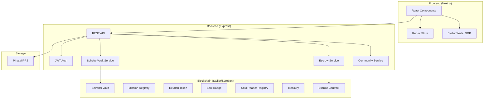
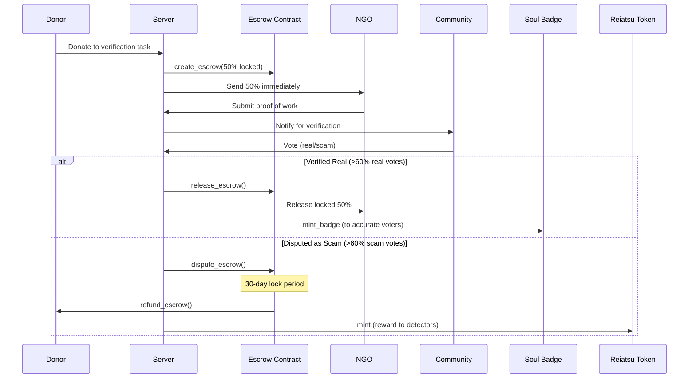

<div align="center">
  <h1 align="center">✨ Soul-Society</h1>
  <p align="center">Revolutionizing Aid Distribution with Blockchain Technology</p>
  
  [](https://opensource.org/licenses/MIT)
  [](https://stellar.org/)
  [](https://nextjs.org/)
  [](https://soroban.stellar.org/)
  [](https://github.com/yourusername/soul-society/actions)

  
</div>

---

## 📖 Documentation

Detailed documentation has been moved to the `docs/` directory:

- [📚 API Documentation](docs/API_DOCUMENTATION.md)
- [🧩 Smart Contracts](docs/SMART_CONTRACT_README.md)
- [💰 Payment Flow Guide](docs/PAYMENT_FLOW_GUIDE.md)
- [🔒 Seireitei Vault](docs/VAULT.md)
- [🛠 Backend Server Guide](docs/SERVER_README.md)

---

## 🏗 System Architecture

Soul-Society uses a hybrid architecture combining a high-performance Next.js frontend, an Express.js backend for off-chain coordination, and a suite of Soroban smart contracts for trustless execution.



---

## 🛡️ Escrow & Governance ("Lock, Do Work, Get Paid")

The core of Soul-Society is the **Trustless Escrow System** designed to prevent charity fraud.

### How it Works
1. **Donation**: Donor contributes to a task. 50% goes to NGO immediately; 50% is **locked in escrow**.
2. **Proof**: NGO submits proof-of-work (photos/videos) to IPFS.
3. **Verification**: Community members vote on the authenticity of the proof.
4. **Outcome**:
   - ✅ **Verified**: Locked funds released to NGO. Voters earn **Soul Badges** and **Reiatsu Tokens**.
   - ❌ **Scam**: Funds remain locked for 30 days, then **refunded to donor**.



---

## 🚀 Getting Started

### Prerequisites
- Node.js v20+
- Cargo & Rust (for contracts)
- Docker (optional)

### Quick Start (Docker)
```bash
docker-compose up --build
```
This starts:
- Frontend: http://localhost:3000
- Server: http://localhost:8000

### Manual Setup

#### 1. Smart Contracts
```bash
cd smartContract
cargo test  # Verify all 42 tests pass
```

#### 2. Server
```bash
cd server
npm install
npm run dev
```

#### 3. Frontend
```bash
cd frontend
npm install --legacy-peer-deps
npm run dev
```

---

## 🏆 Stellar Journey to Mastery
**Current Status: Green Belt (Level 4) Completed** ✅

- [x] **Contracts**: Inter-contract calls (Escrow ↔ Token ↔ Badge)
- [x] **Tokens**: Custom Reiatsu Token (RA) with staking & vesting
- [x] **Real-time**: Advanced event streaming (Seireitei Alert System)
- [x] **DevOps**: Full CI/CD pipeline with GitHub Actions
- [x] **Design**: Mobile responsive "Bleach" aesthetic

---

## 🤝 Contributing
We welcome contributions! Please see [CONTRIBUTING.md](CONTRIBUTING.md) for guidelines.

## 📄 License
This project is licensed under the MIT License - see the [LICENSE](LICENSE) file for details.
